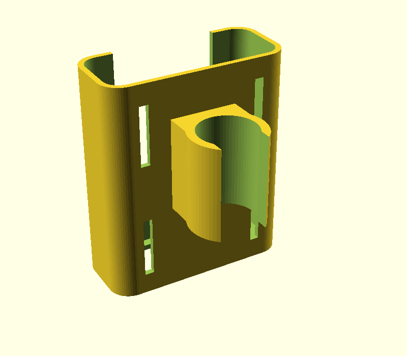
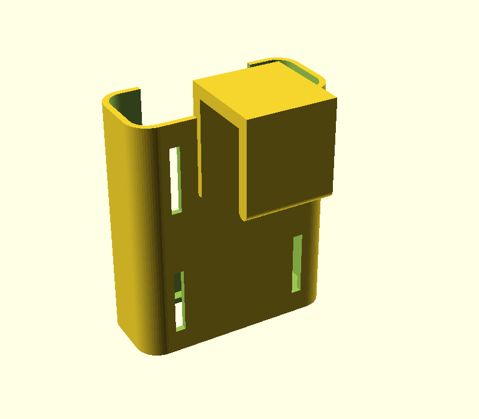

# Suporte de power bank para tripé

Suporte para pendurar o **Xiaomi Mi 50W Power Bank 20000mAh (PB2050SZM)** no tripé.

Medidas usadas (especificação oficial): **154 × 74 × 28 mm**, com 0,8 mm de folga por lado.

O power bank fica em pé num berço aberto em cima, com as portas para cima. Uns 60 mm
ficam para fora, então as portas, o botão e os LEDs continuam livres. A janela na frente
deixa empurrar o power bank por baixo (pelo furo do fundo) para tirar.

| Arquivo | Fixação |
|---|---|
| `suporte_clip.stl` | Abraçadeira de encaixe para a **coluna central** (Ø 25 mm). Encaixa na coluna e fica apoiada em cima do anel onde se prendem os braços das pernas. |
| `suporte_gancho.stl` | Gancho em U invertido (vão de 26 mm) para pendurar numa perna, braço ou barra. |
| `suporte_powerbank_tripe.scad` | Modelo paramétrico no OpenSCAD, para ajustar as medidas. |

Todas as versões têm 4 rasgos na parte de trás para passar **velcro ou abraçadeira de nylon**,
que podem ser usados sozinhos ou como reforço.

 

## Antes de imprimir: meça o tripé
Os valores padrão são estimados pelas fotos. Meça com um paquímetro e ajuste no OpenSCAD
(*Window → Customizer*):

- `diametro_tubo`: diâmetro da coluna central (versão clip)
- `vao_gancho`: largura da peça onde o gancho vai pendurar (some ~1 mm de folga)
- `abertura_clip`: diminua (ex.: 0,78) se o clip ficar solto, aumente se estiver difícil de encaixar

Depois exporte com F6 e depois F7 (STL).

## Impressão
- **PETG** é o recomendado: o clip precisa flexionar e o PLA pode trincar.
- Imprima em pé (boca do berço para cima), **sem suporte**.
- 3–4 perímetros, 20–25% de preenchimento, camada de 0,2 mm.
