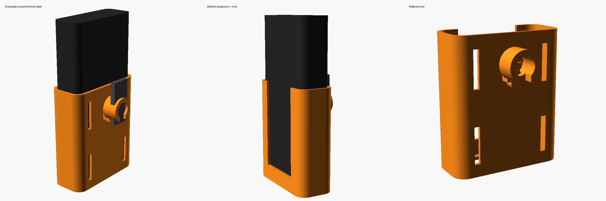

# Suporte de power bank para tripé

Suporte para pendurar o **Xiaomi Mi 50W Power Bank 20000mAh (PB2050SZM)** no tripé.

Medidas usadas (especificação oficial): **154 × 74 × 28 mm**, com 0,8 mm de folga por lado.

O power bank fica em pé num berço aberto em cima, com as portas para cima. Uns 60 mm
ficam para fora, então as portas, o botão e os LEDs continuam livres. A janela na frente
deixa empurrar o power bank por baixo (pelo furo do fundo) para tirar.

| Arquivo | Fixação |
|---|---|
| `suporte_clip.stl` | Abraçadeira de encaixe para a **coluna central** (Ø 25 mm). Encaixa na coluna e fica apoiada em cima do anel onde se prendem os braços das pernas. |
| `suporte_mosquetao.stl` | Gancho aberto tipo **mosquetão**, que pendura na pontinha arredondada da haste (a peça com os 2 furos ovais) e apoia na base dela. Tem um nub oval frouxo que entra no furo oval de baixo só para não escorregar de lado. |
| `suporte_powerbank_tripe.scad` | Modelo paramétrico no OpenSCAD, para ajustar as medidas. |

Todas as versões têm 4 rasgos na parte de trás para passar **velcro ou abraçadeira de nylon**,
que podem ser usados sozinhos ou como reforço.

## Antes de imprimir: meça o tripé
Os valores padrão são estimados pelas fotos. Meça com um paquímetro e ajuste no OpenSCAD
(*Window → Customizer*):

**Versão clip** (coluna central):
- `diametro_tubo`: diâmetro da coluna. Diminua `abertura_clip` se ficar solto.

**Versão mosquetão** (pontinha arredondada da haste, perto do furo oval de 8,3 × 14,2 mm):
- `raio_ponta`: raio da pontinha arredondada onde o gancho se apoia — **é a medida mais importante**.
- `espessura_peca`: grossura dessa pontinha.
- `distancia_furo_ponta`: distância do centro do furo oval de baixo até o centro da pontinha.
- Se não quiser o nub de trava, ponha `usar_nub = false`.

Depois exporte com F6 e depois F7 (STL).

## Impressão
- **PETG** é o recomendado: o clip e o mosquetão precisam flexionar e o PLA pode trincar.
- Imprima em pé (boca do berço para cima), **sem suporte**.
- 3–4 perímetros, 20–25% de preenchimento, camada de 0,2 mm.
