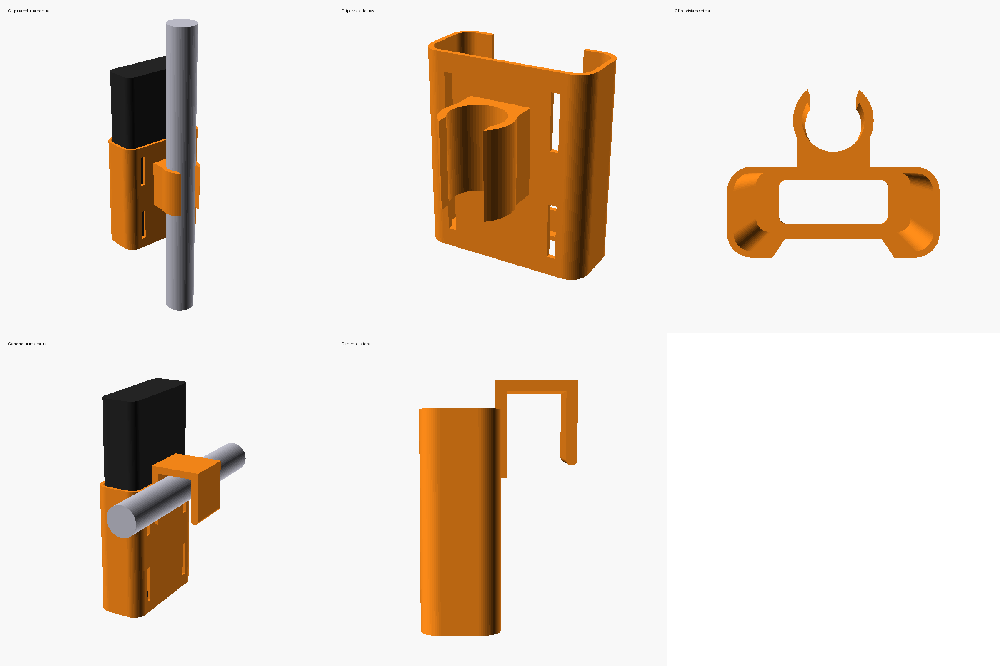
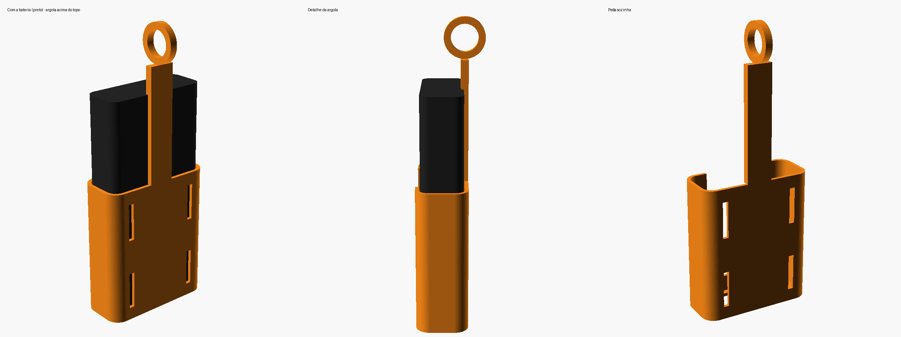

# Suporte de power bank para tripé

Suporte para pendurar o **Xiaomi Mi 50W Power Bank 20000mAh (PB2050SZM)** no tripé.

Medidas usadas (especificação oficial): **154 × 74 × 28 mm**, com 0,8 mm de folga por lado.

O power bank fica em pé num berço aberto em cima, com as portas para cima. Uns 60 mm
ficam para fora, então as portas, o botão e os LEDs continuam livres. A janela na frente
deixa empurrar o power bank por baixo (pelo furo do fundo) para tirar.

| Arquivo | Fixação |
|---|---|
| `suporte_clip.stl` | Abraçadeira de encaixe para a **coluna central** (Ø 25 mm). Encaixa na coluna e fica apoiada em cima do anel onde se prendem os braços das pernas. |
| `suporte_argola.stl` | **Argola** para um **mosquetão de verdade** (de chaveiro/alpinismo, não impresso). Um poste sobe atrás do berço e passa da altura total do power bank: a argola fica acima da bateria inteira, então tudo pendura abaixo do ponto onde o mosquetão prende no tripé, sem ficar torto. |
| `suporte_powerbank_tripe.scad` | Modelo paramétrico no OpenSCAD, para ajustar as medidas. |

Todas as versões têm 4 rasgos na parte de trás para passar **velcro ou abraçadeira de nylon**,
que podem ser usados sozinhos ou como reforço.

## Antes de imprimir: meça o tripé
Os valores padrão são estimados. Meça com um paquímetro e ajuste no OpenSCAD
(*Window → Customizer*):

**Versão clip** (coluna central):
- `diametro_tubo`: diâmetro da coluna. Diminua `abertura_clip` se ficar solto.

**Versão argola** (mosquetão de verdade):
- `diametro_argola`: tem que ser maior que a espessura do mosquetão que você vai usar, para ele passar por dentro.
- `margem_acima_bateria`: quanto a argola fica acima do topo do power bank (padrão 18 mm).
- `largura_poste` / `espessura_poste`: aumente se achar o poste fino demais (ele fica em balanço, sem apoio).

Depois exporte com F6 e depois F7 (STL).

## Impressão
- **PETG** é o recomendado.
- Imprima em pé (boca do berço para cima), **sem suporte**, exceto talvez o furo da argola
  (é uma ponte horizontal de ~18 mm — geralmente sai sem suporte, mas se ficar ruim, ative
  suporte só para essa parte, ou peça uma "raindrop hole" no lugar do furo redondo).
- 3–4 perímetros, 20–25% de preenchimento, camada de 0,2 mm.
